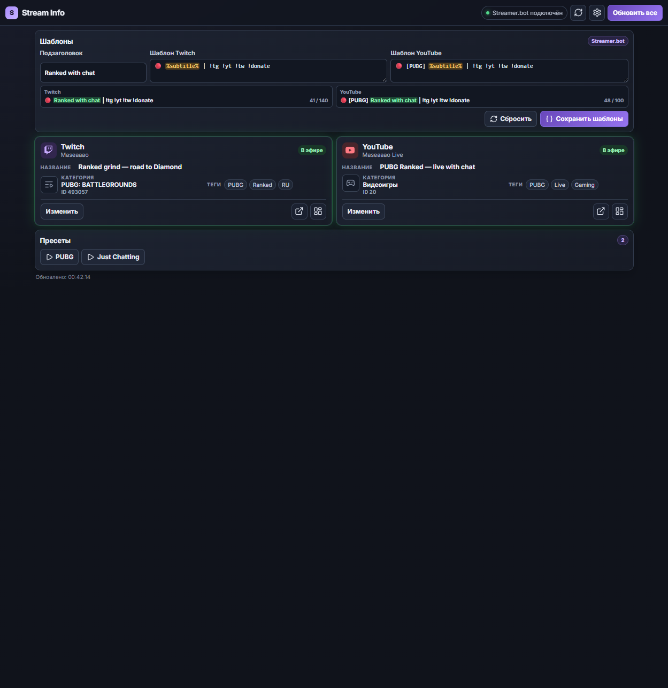
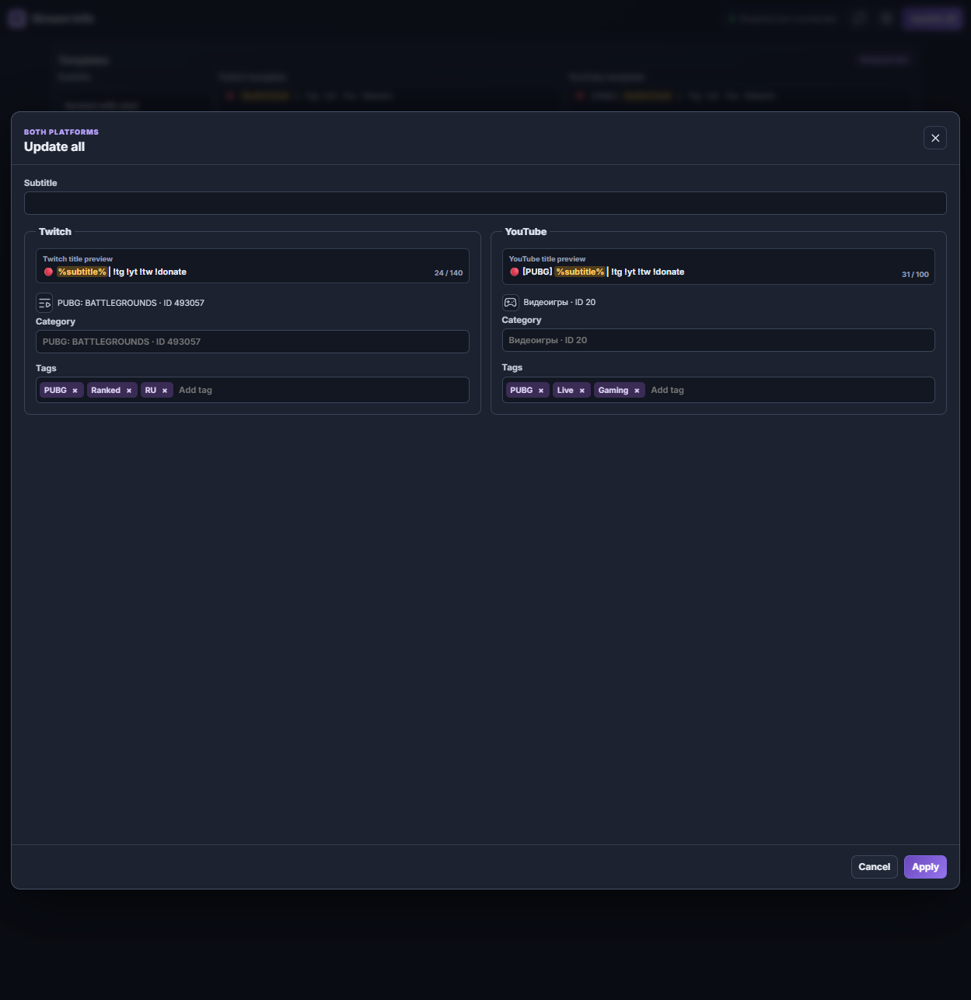

# Stream Info для Streamer.bot

[English version](README.md)

Самодостаточная HTML-панель для обновления информации Twitch и YouTube прямо из OBS Dock. Она подключается только к локальному WebSocket Streamer.bot: без сервера, OAuth-страницы и внешних UI-зависимостей.



## Возможности

- Обновляет название, категорию и теги Twitch и активного YouTube-эфира.
- Хранит шаблоны названий Twitch и YouTube в постоянных переменных Streamer.bot.
- Находит Action вида `PRESET | …` в группе `STREAM INFO` для игровых пресетов.
- Открывает правильный раздел YouTube Studio как во время эфира, так и вне эфира.
- Работает как один HTML-файл, который можно открыть напрямую через `file://`.
- Собирает полноценные HTML на русском, английском, испанском и упрощённом китайском.

## Быстрый запуск

1. Откройте [change-info-streamer-bot.html](change-info-streamer-bot.html).
2. Убедитесь, что встроенный WebSocket-сервер Streamer.bot включён.
3. Если панель попросит импорт, скопируйте [streamerbot-import.txt](streamerbot-import.txt), нажмите **Import** в Streamer.bot и завершите импорт.
4. Вернитесь в Stream Info и нажмите «Проверить снова».

По умолчанию страница подключается к `ws://127.0.0.1:8080/`. Если WebSocket защищён паролем, введите его в панели подключения или в настройках. Twitch OAuth-данные остаются внутри Action Streamer.bot и никогда не встраиваются в HTML.

## Языки и сборка

Файл `change-info-streamer-bot.html` в репозитории — русская версия, готовая к открытию двойным кликом. Чтобы собрать все самостоятельные варианты:

```powershell
npm install
npm run build
```

| Язык | Создаваемый файл |
| --- | --- |
| Русский | `dist/change-info-streamer-bot.ru.html` |
| Английский | `dist/change-info-streamer-bot.en.html` |
| Испанский | `dist/change-info-streamer-bot.es.html` |
| Упрощённый китайский | `dist/change-info-streamer-bot.zh.html` |

Для безопасного визуального показа с примерными данными добавьте к любому собранному HTML `?demo=1`. В этом режиме страница не подключается к Streamer.bot и не меняет данные платформ.



## Шаблоны и пресеты

Шаблоны названий находятся в «Настройках». Первый рабочий блок — «Подзаголовок»: он сохраняет подзаголовок и применяет сформированные названия к подключённому Twitch и активному эфиру YouTube. В каждом шаблоне допускается не более одного `%subtitle%`.

Чтобы создать игровой пресет, сделайте Action в группе `STREAM INFO` с именем `PRESET | Название игры`. Задайте нужные постоянные глобальные переменные и вызовите `STREAM INFO | API` с аргументом `command = applyPreset`:

| Переменная | Назначение |
| --- | --- |
| `stream_info.template.twitch` | шаблон Twitch |
| `stream_info.template.youtube` | шаблон YouTube |
| `stream_info.template.subtitle` | подзаголовок |
| `stream_info.preset.twitchCategoryId` | ID категории Twitch |
| `stream_info.preset.youtubeCategoryName` | название категории YouTube |
| `stream_info.preset.twitchTagsJson` | JSON-массив Twitch-тегов |
| `stream_info.preset.youtubeTagsJson` | JSON-массив YouTube-тегов |

Пустая переменная не меняет соответствующее поле. Если эфир YouTube не запущен, панель пропустит его, но Twitch всё равно сможет обновиться.

Импортированная Action `STREAM INFO | API` также подписана на событие **YouTube → Broadcast Started**. При обнаружении запуска она сразу применяет к новому эфиру явно сохранённые шаблон названия, подзаголовок, категорию и теги YouTube. Twitch при этом не изменяется. На чистой установке без сохранённых параметров YouTube эфир останется без изменений. После обновления с более ранней версии повторно импортируйте [streamerbot-import.txt](streamerbot-import.txt), чтобы установить триггер.

## Разработка

```powershell
npm install
npm test
npm run build
```

Для тестов нужны Node.js и .NET 8 SDK. `npm run build` пересобирает нативную Import-строку Streamer.bot, проверяет TypeScript и создаёт четыре самостоятельных HTML. `dist/` хранится в Git, потому что это готовый продукт для пользователей; если изменение влияет на сборку, обновлённые файлы из неё нужно включить в коммит.

## Релизы

При отправке тега с именем `v*` GitHub создаёт Release: в нём лежат каждый HTML-файл из `dist/` и ZIP-архив со всем дистрибутивом. Пользователь может скачать нужный язык без Node.js и сборки проекта.

## Безопасность и участие

Перед сообщением об уязвимости прочитайте [SECURITY.ru.md](SECURITY.ru.md). Правила участия — в [CONTRIBUTING.ru.md](CONTRIBUTING.ru.md) и [CODE_OF_CONDUCT.ru.md](CODE_OF_CONDUCT.ru.md).

## Благодарности

Спасибо [nutty.gg](https://nutty.gg/) за идею и вдохновение для сфокусированного интерфейса управления стримом.

## Лицензия

[MIT](LICENSE) © 2026 maxxborer
